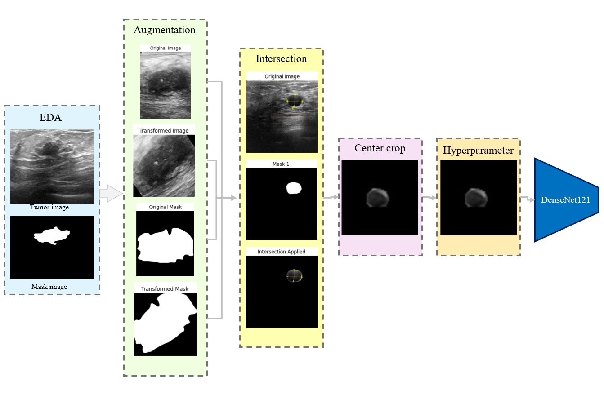

# 🩺 Breast Cancer Image Classification Using DenseNet121

This repository demonstrates a machine learning pipeline to classify breast ultrasound images into three categories: **normal**, **benign**, and **malignant**. The primary goal is to improve classification accuracy by applying various experimental techniques, such as data augmentation and intersection masking, and tuning hyperparameters.

---

## **📜 Project Overview**

### The project architecture: 

This project focuses on leveraging machine learning to accurately classify breast ultrasound images, contributing to early breast cancer detection and diagnosis. The workflow includes:
1. **Train on DenseNet121**: Train raw ultrasound images on the DenseNet121 architecture with typical preprocessing transformations.
2. **Data Augmentation**: Balance class distributions through transformations like random rotation, flipping, and cropping.
3. **Intersection Masking**: Enhance classification by emphasizing tumor regions using intersection masks.
4. **Hyperparameter Tuning**: Optimize model performance by adjusting hyperparameters such as learning rate, batch size, and optimizer settings.

---

## 📂 Dataset

The dataset used in this project is the Breast Ultrasound Images Dataset, available on Kaggle.
[Breast Ultrasound Images Dataset](https://www.kaggle.com/datasets/aryashah2k/breast-ultrasound-images-dataset)

---

## **⚙️ Project Steps**

### 1. Data Preparation

The following transformations were applied to the dataset during the initial DenseNet121 training:
- 📏 **Resizing**: Images resized to 256 pixels while maintaining aspect ratio.
- 🔳 **Center Cropping**: Cropped to \(224 	imes 224\) pixels for compatibility.
- 🔄 **Random Rotation**: Small rotation (±5°) to introduce variability.
- 🔃 **Horizontal Flipping**: Applied with a probability of 0.5.
- 📦 **Tensor Conversion**: Converted images to PyTorch tensors.

---

### 2. Data Augmentation

To balance the dataset, the following techniques were applied:
- 📏 **Resizing**: Images resized to 256 pixels while maintaining aspect ratio.
- 🔄 **Random Rotation**: Introduced 70-degree variability.
- 🔃 **Horizontal Flipping**: Applied with a probability of 0.5.
- ✂️ **Center Cropping**: Focused on tumor regions by cropping to \(224 	imes 224\).

After augmentation, the class distribution became:
- 🟡 Benign: 891
- 🔴 Malignant: 891
- 🟢 Normal: 890

Access the [Preproccessing Notebook](./data_preproccessing.ipynb) to see the preprocessing in detail. After balancing, the dataset was retrained under the same conditions ([Augmentation Notebook](./Augmentation.ipynb)).

---

### 3. Intersection Masking

To emphasize tumor regions:
- 🖼️ Created intersection masks for the ultrasound images.
- ✂️ Cropped the images to \(224 	imes 224\), focusing on diagnostically relevant regions.

Access the [Preproccessing Notebook](./data_preproccessing.ipynb) to see the preprocessing in detail. After intersection, the dataset was retrained under the same conditions ([Intersection Notebook](./iIntersection.ipynb)).

---

### 4. Model Training and Hyperparameter Tuning

- Model: **DenseNet121**
- Optimizer: **Adam**
- Learning Rate: **0.0001**
- Loss Function: **Cross-Entropy Loss**
- Epochs: **100**

Hyperparameter tuning experiments aimed to optimize accuracy. Access the [Hyperparameter Notebook](./hyperparameter.ipynb) for details.

Trained model weights are available [here](./densenet121_ultrasound_best.pth).

---
📋 Requirements

Below is a list of libraries required for this project:

    torch==1.10.1+cu113
    torchvision==0.10.0+cu113
    torchaudio==0.10.1+cu113
    numpy==1.20.3
    pandas==1.2.4
    matplotlib==3.4.2
    seaborn==0.11.1
    opencv-python==4.5.3.56
    scikit-learn==0.24.2
    tensorflow==2.9.0
    keras==2.9.0
    Pillow==8.2.0

    
You can download the complete requirements.txt file from [here](./requirements.txt).
---

## **📊 Results**

### 🧪 Initial Model (No Augmentation)
- **Best Validation Accuracy**: 87.18%

### 🔄 Data Augmentation
- **Best Validation Accuracy**: 93.61%

### 🖼️ Intersection Masking
- **Best Validation Accuracy**: **98.87%**

---

### Model Accuracy 

### Model Loss 
